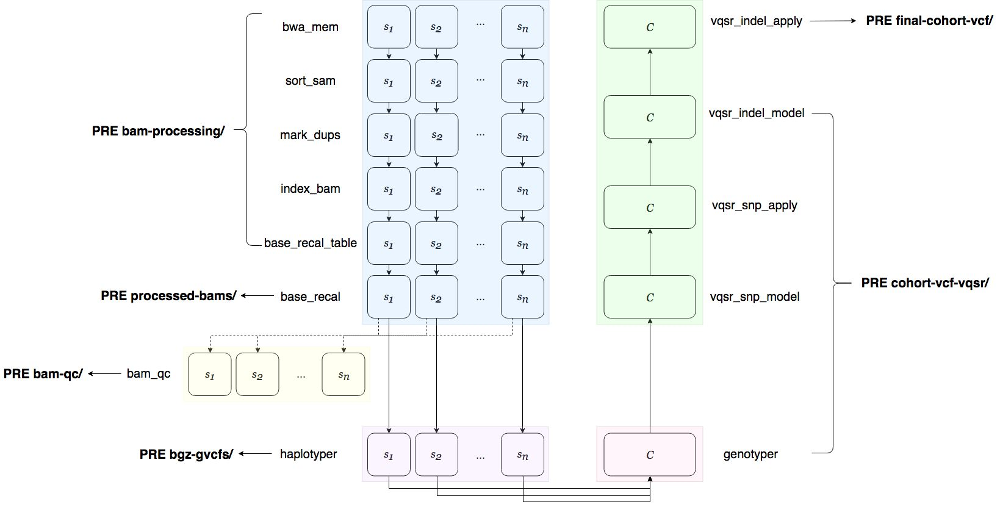

.. _sec-out:

====================================
Running the Pipeline and its Outputs
====================================

.. _run:

Starting a Run
--------------

Once ``run.yaml`` has been properly filled out, the pipeline can be 
launched (with an internet connection) with the following command:

::

   (psy-ngs) $ cd path/to/this/repo/
   (psy-ngs) $ python rkstr8_driver.py -p <pipeline-name> [ -a access_key_id ] [ -s secret_access_key ]

* ``pipeline-name`` at the moment is only ``germline_wgs``.

* ``access_key_id`` and ``secret_access_key`` are the ``ACCESS_KEY_ID`` and 
	``SECRET_ACCESS_KEY`` key pair associated with the user's AWS account. (Note: These only have to be included if you are running any Google Cloud processes.)

The pipeline initialization takes approximately 5 minutes.  
Afterwards, since the pipeline is serverless, the user can close their laptop 
(or similarly shut down their computer), and the pipeline will continue to run
on AWS in the background.

Pipeline Output
---------------

For a given pipeline run, the user specifies the ``OUTPUT`` field in
the ``run.yaml`` file.  All of the intermediate files and the final results of
the pipeline will be uploaded under the ``OUTPUT`` uri in the following scheme
if, for example, ``OUTPUT`` was set to ``s3://analysis/results/``:

.. code-block:: text
	
	aws s3 ls s3://analysis/results/
			PRE bam-processing/
			PRE bam-qc/
			PRE bgz-gvcfs/
			PRE cohort-vcf-vqsr/
			PRE final-cohort-vcf/
			PRE logs/
			PRE processed-bams/

The figure below illustrates what files are written under which of the above
prefixes.  Note that the ``PRE bam-qc/`` prefix only appears if the user has
listed ``BAM`` for the ``QC`` parameter in ``run.yaml``.

The ``logs/`` prefix contains the logs for all of the pipeline steps.

