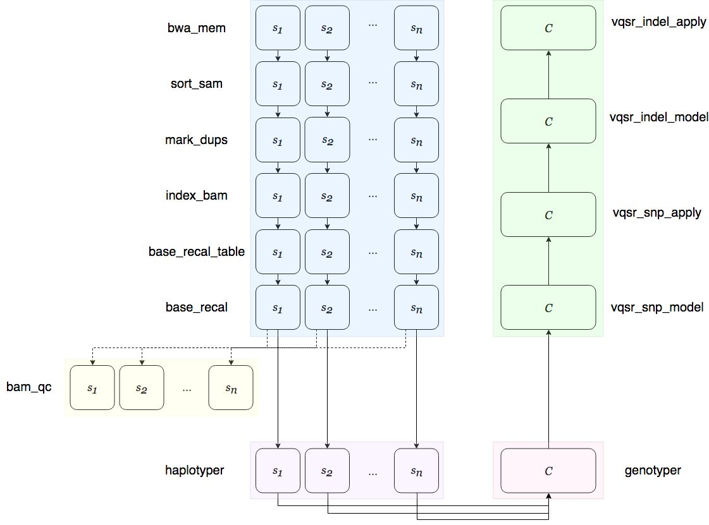
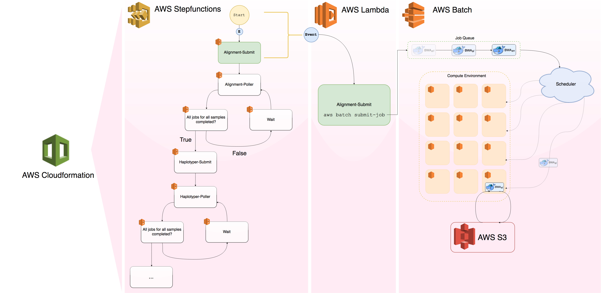

.. _sec-overview:

=================
Pipeline Overview
=================

Genomics Workflow
-----------------
The PsychCore NGS pipeline is a serverless, automated, easy to use genomics 
pipeline for calling germline variants on large cohorts of human sequencing samples, as well as de novo variants. The workflow of the pipeline is as follows:

The pipeline takes gzipped paired end sequencing fastq files (R1|R2.fastq.gz) 
for each sample and aligns them to a specified reference build, using BWA MEM.  
Several BAM processing steps (Picard and GATK) follow to produce a final 
processed BAM, which is haplotyped using Sentieon's* Haplotyper module.  This
BAM can optionally undergo a quality analysis using Picard's ``CollectWGSMetrics``
module.  These steps are done in parallel for each sample in the cohort.  
After Haplotyper is run, joint genotyping is performed accross the entire 
cohort with Sentieon's Genotyper module, producing a VCF that gets passed to VQSR (GATK) and 
outputs the final VCF.

.. _infrastructure:

Pipeline Infrastructure
-----------------------

Several AWS services are invovled in the infrastructure of the pipeline -
AWS CloudFormation_, StepFunctions_, Lambda_, Batch_, EC2_, S3_, and CloudWatch_.
The pipeline also makes use of Docker_ containers, as well as Google Cloud
Platform's (GCP_) Google Cloud Storage (GCS_) and Dataproc_ services for downstream processes (in development).

The pipeline's main bioinformatics tools are `BWA MEM`_, Picard_, 
GATK_, and Sentieon_.  Each of these tools have been (Docker) 
containerized and are deployed using AWS Batch. AWS Lambda 
and AWS StepFunctions manage the submission of jobs to the Batch
cluster as well as the handling of user input.  The entire system
architecture of the pipeline is managed by AWS CloudFormation while
logging during the run of the pipeline is handled by AWS CloudWatch.

A Note about Sentieon
-------------------------
Sentieon develops and supplies a suite of bioinformatics analysis tools for 
processing genomics data.  In 2016, Sentieon won the PrecisionFDA Truth_ and 
Consistency_ challenges. Sentieon also won first place in 
`ICGC TCGA Dream Mutation Calling Challenge`_. 
For more information, see Sentieon's homepage here_.

.. _Truth: https://precision.fda.gov/challenges/truth/results
.. _Consistency: https://precision.fda.gov/challenges/consistency/results
.. _ICGC TCGA Dream Mutation Calling Challenge: https://www.synapse.org/#!Synapse:syn312572/wiki/247695
.. _here: https://www.sentieon.com
.. _CloudFormation: https://aws.amazon.com/cloudformation/
.. _StepFunctions: https://aws.amazon.com/step-functions/
.. _Lambda: https://aws.amazon.com/lambda/
.. _Batch: https://aws.amazon.com/batch/
.. _EC2: https://aws.amazon.com/ec2/
.. _S3: https://aws.amazon.com/s3/
.. _CloudWatch: https://aws.amazon.com/cloudwatch/
.. _Docker: https://www.docker.com
.. _GCP: https://cloud.google.com
.. _GCS: https://cloud.google.com/storage/
.. _Dataproc: https://cloud.google.com/dataproc/
.. _BWA MEM: http://bio-bwa.sourceforge.net/bwa.shtml
.. _Picard: https://broadinstitute.github.io/picard/
.. _GATK: https://software.broadinstitute.org/gatk/documentation/tooldocs/3.8-0/
.. _Sentieon: https://www.sentieon.com
